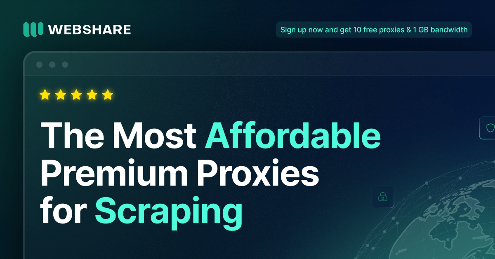

# Webshare.io: The Most Affordable Premium Proxies on the Market

  

  

## Why Choose Webshare? ✅

---

### Robust Performance & Features at a Fraction of the Price

* 195+ country coverage & 80,000,000+ IPs
* 99.97% uptime guarantee
* IP/password authentication
* IP rotation & backbone connectivity
* API integration
* HTTP/SOCKS5 protocol support

### Ultimate Flexibility

* Choose between Shared, Private, and Dedicated tiers for Datacenter & ISP plans
* New users start completely FREE with 10 proxies & 1 GB
* FREE Chrome browser extension
* Advanced dashboard for proxy usage tracking and management

## Get Started 🚀

---

New to Webshare? Start completely FREE by creating an account: you'll get 10 proxies + 1 GB/mo of bandwidth to use for as long as you like, no credit card required.

[Start Now](https://www.webshare.io/?referral_code=0q3l81eet8mp)
